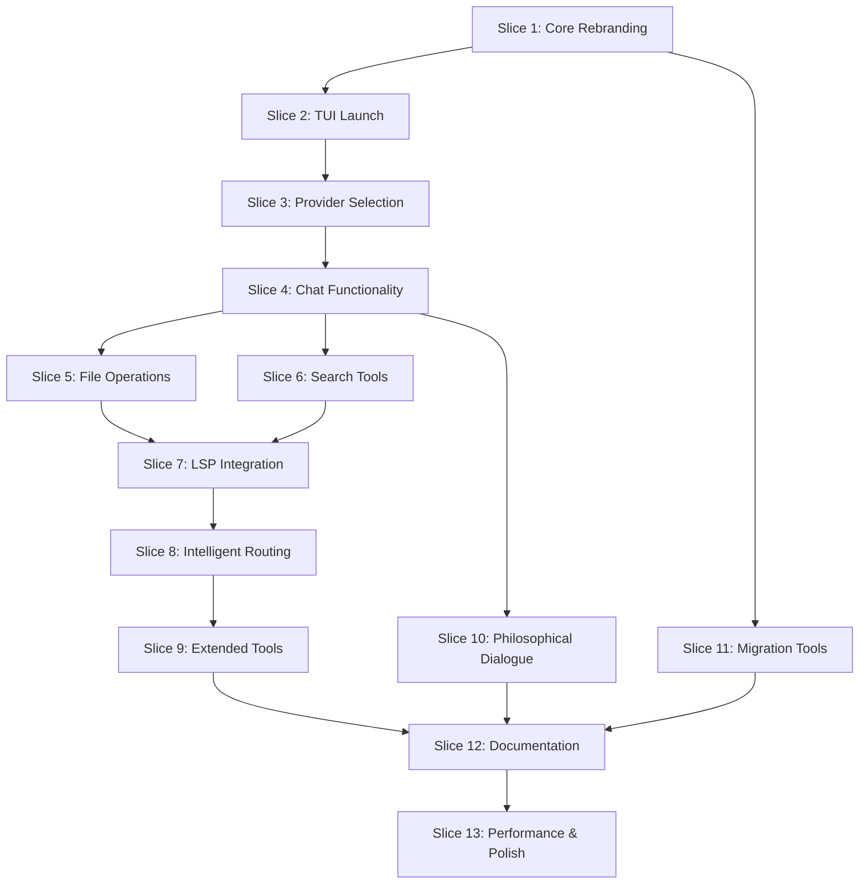

# Plato Vertical Slices

## Overview
This document defines the vertical slices for Plato MVP development. Each slice represents a complete, deployable feature that delivers user value.

---

## Slice 1: Core Rebranding Infrastructure

### Description
Complete transformation of OpenCode namespace to Plato across all components.

### Acceptance Criteria
- [ ] All "opencode" references replaced with "plato" in codebase
- [ ] Configuration files renamed (opencode.json → plato.json)
- [ ] Environment variables updated ($OPENCODE_* → $PLATO_*)
- [ ] Installation scripts updated for new namespace
- [ ] Package.json files reflect Plato branding
- [ ] Repository successfully forked to anubissbe/plato
- [ ] Build process completes without errors

### Technical Tasks
1. Fork repository to anubissbe/plato
2. Global find/replace for namespace transformation
3. Update all configuration schemas
4. Modify installation scripts
5. Update package metadata
6. Verify build system

### Definition of Done
- ✅ Code compiles and builds successfully
- ✅ All tests pass with new namespace
- ✅ No hardcoded "opencode" references remain
- ✅ Installation script works with plato namespace
- ✅ Documentation updated with new names
- ✅ Peer review completed
- ✅ Deployed to development environment

### Estimated Effort: 3-4 days

---

## Slice 2: Basic TUI Application Launch

### Description
Ensure Plato launches as a functional TUI CLI application with basic interaction.

### Acceptance Criteria
- [ ] `plato` command launches TUI interface
- [ ] Terminal UI renders correctly
- [ ] Basic navigation works (keyboard shortcuts)
- [ ] Help command displays Plato information
- [ ] Version command shows correct version
- [ ] Exit cleanly with proper cleanup

### Technical Tasks
1. Verify TUI framework functionality
2. Update CLI entry points
3. Implement Plato branding in UI
4. Test terminal compatibility
5. Add version management

### Definition of Done
- ✅ TUI launches without errors
- ✅ All basic commands functional
- ✅ Tested on Linux/Mac/Windows terminals
- ✅ Memory leaks checked
- ✅ Performance baseline established
- ✅ User documentation created

### Estimated Effort: 2-3 days

---

## Slice 3: Provider & Model Selection

### Description
Enable AI provider selection and model configuration within Plato.

### Acceptance Criteria
- [ ] List available providers command works
- [ ] Provider selection persists in config
- [ ] Model selection within provider works
- [ ] API key configuration functional
- [ ] Error handling for invalid credentials
- [ ] Fallback to default provider works

### Technical Tasks
1. Implement provider listing
2. Create provider selection UI
3. Add credential validation
4. Implement configuration persistence
5. Add error handling and recovery

### Definition of Done
- ✅ All major providers accessible
- ✅ Credentials securely stored
- ✅ Provider switching seamless
- ✅ Error messages user-friendly
- ✅ Configuration persists across sessions
- ✅ Security audit passed

### Estimated Effort: 3-4 days

---

## Slice 4: Basic Chat Functionality

### Description
Core conversational AI interaction through the terminal interface.

### Acceptance Criteria
- [ ] Send message to AI and receive response
- [ ] Conversation history maintained
- [ ] Multi-line input supported
- [ ] Response streaming works
- [ ] Interrupt/cancel functionality
- [ ] Session management operational

### Technical Tasks
1. Implement message handling
2. Create response streaming
3. Add session persistence
4. Implement interrupt handling
5. Add conversation history

### Definition of Done
- ✅ End-to-end conversation works
- ✅ Responses stream smoothly
- ✅ History persists between sessions
- ✅ Graceful error handling
- ✅ Performance < 100ms initial response
- ✅ Load testing completed

### Estimated Effort: 4-5 days

---

## Slice 5: File Operations Tools (Read/Write/Edit)

### Description
Implement core file manipulation tools accessible through Plato commands.

### Acceptance Criteria
- [ ] Read file contents command works
- [ ] Write/create files command works
- [ ] Edit files with replacements works
- [ ] Permission handling correct
- [ ] Path validation implemented
- [ ] Undo/redo functionality available

### Technical Tasks
1. Implement file read tool
2. Implement file write tool
3. Implement file edit tool
4. Add permission checking
5. Add path validation
6. Implement undo system

### Definition of Done
- ✅ All file operations functional
- ✅ Permission errors handled gracefully
- ✅ Path traversal prevention implemented
- ✅ Large file handling optimized
- ✅ Atomic operations ensured
- ✅ Backup system operational

### Estimated Effort: 4-5 days

---

## Slice 6: Search Tools (Grep/Glob/List)

### Description
Implement search and discovery tools for code navigation.

### Acceptance Criteria
- [ ] Grep search with regex works
- [ ] Glob pattern matching works
- [ ] Directory listing functional
- [ ] Search results properly formatted
- [ ] Performance acceptable for large codebases
- [ ] Filters and options available

### Technical Tasks
1. Implement grep tool with regex
2. Implement glob pattern matching
3. Implement directory listing
4. Add result formatting
5. Optimize for performance
6. Add filtering options

### Definition of Done
- ✅ All search tools operational
- ✅ Regex patterns validated
- ✅ Results paginated appropriately
- ✅ Performance < 1s for 10k files
- ✅ Memory usage optimized
- ✅ Edge cases handled

### Estimated Effort: 3-4 days

---

## Slice 7: Enhanced LSP Integration

### Description
Multi-language LSP support with improved code intelligence.

### Acceptance Criteria
- [ ] Auto-detect language servers
- [ ] Multiple LSP servers can run simultaneously
- [ ] Code completion works in TUI
- [ ] Error diagnostics displayed
- [ ] Hover information available
- [ ] Go-to-definition functional

### Technical Tasks
1. Implement LSP client manager
2. Add language server detection
3. Create TUI integration for LSP features
4. Implement diagnostic display
5. Add hover and completion UI
6. Test with multiple languages

### Definition of Done
- ✅ 5+ languages supported
- ✅ LSP features responsive
- ✅ Memory usage acceptable
- ✅ Graceful fallback without LSP
- ✅ Performance benchmarked
- ✅ Integration tests passing

### Estimated Effort: 5-6 days

---

## Slice 8: Intelligent Routing System

### Description
Smart request routing for optimal tool and model selection.

### Acceptance Criteria
- [ ] Automatic tool selection based on request
- [ ] Model routing based on task type
- [ ] Context-aware processing
- [ ] Performance optimization functional
- [ ] Routing rules configurable
- [ ] Metrics and logging available

### Technical Tasks
1. Design routing algorithm
2. Implement request analyzer
3. Create routing rules engine
4. Add performance optimization
5. Implement metrics collection
6. Add configuration interface

### Definition of Done
- ✅ Routing accuracy > 90%
- ✅ Response time improved by 20%
- ✅ Rules easily configurable
- ✅ Metrics dashboard available
- ✅ A/B testing framework ready
- ✅ Documentation complete

### Estimated Effort: 4-5 days

---

## Slice 9: Extended Tools Suite (7 Additional Tools)

### Description
Implement the remaining 7 tools from the 13 embedded tools vision.

### Tools to Implement
1. **analyze-code** - Static code analysis
2. **refactor** - Code refactoring assistance
3. **security-scan** - Security vulnerability detection
4. **performance-profile** - Performance analysis
5. **test-generator** - Automated test creation
6. **documentation** - Doc generation
7. **deployment** - Deployment assistance

### Acceptance Criteria (per tool)
- [ ] Tool accessible via CLI command
- [ ] Core functionality operational
- [ ] Error handling implemented
- [ ] Help documentation available
- [ ] Integration with AI context
- [ ] Performance acceptable

### Definition of Done (overall)
- ✅ All 7 tools functional
- ✅ Consistent interface design
- ✅ Performance benchmarked
- ✅ Documentation complete
- ✅ Integration tests passing
- ✅ User feedback incorporated

### Estimated Effort: 8-10 days

---

## Slice 10: Philosophical Dialogue System

### Description
Implement Plato-inspired philosophical dialogue and wisdom features.

### Acceptance Criteria
- [ ] Philosophical quotes integrated
- [ ] Socratic questioning mode available
- [ ] Wisdom-driven suggestions functional
- [ ] Educational explanations provided
- [ ] Philosophy-themed responses option
- [ ] Customizable philosophy level

### Technical Tasks
1. Create philosophy content database
2. Implement dialogue enhancement system
3. Add Socratic questioning logic
4. Create educational content
5. Add personalization options
6. Test user experience

### Definition of Done
- ✅ Philosophy mode toggleable
- ✅ Content appropriate and relevant
- ✅ No performance impact
- ✅ User satisfaction tested
- ✅ Content reviewed for accuracy
- ✅ Cultural sensitivity verified

### Estimated Effort: 3-4 days

---

## Slice 11: Migration Tools

### Description
Tools and utilities for seamless migration from OpenCode to Plato.

### Acceptance Criteria
- [ ] Auto-detect OpenCode installation
- [ ] Config migration automated
- [ ] Session history preserved
- [ ] Custom commands transferred
- [ ] Rollback capability available
- [ ] Migration report generated

### Technical Tasks
1. Create OpenCode detector
2. Implement config converter
3. Build session migrator
4. Add command migrator
5. Create rollback system
6. Generate migration reports

### Definition of Done
- ✅ 100% data preservation
- ✅ Migration < 1 minute
- ✅ Rollback tested
- ✅ Edge cases handled
- ✅ User guide created
- ✅ Support documentation ready

### Estimated Effort: 3-4 days

---

## Slice 12: Documentation & Help System

### Description
Complete documentation system within Plato and external docs.

### Acceptance Criteria
- [ ] In-app help comprehensive
- [ ] Man pages generated
- [ ] README updated
- [ ] API documentation complete
- [ ] User guide published
- [ ] Video tutorials created

### Technical Tasks
1. Write in-app help system
2. Generate man pages
3. Update all documentation
4. Create user guides
5. Record video tutorials
6. Set up documentation site

### Definition of Done
- ✅ All features documented
- ✅ Examples provided
- ✅ Search functionality works
- ✅ Accessibility standards met
- ✅ Multi-language support ready
- ✅ Community feedback incorporated

### Estimated Effort: 4-5 days

---

## Slice 13: Performance & Polish

### Description
Final optimization, bug fixes, and user experience improvements.

### Acceptance Criteria
- [ ] Startup time < 2 seconds
- [ ] Memory usage optimized
- [ ] All known bugs fixed
- [ ] UI/UX feedback addressed
- [ ] Error messages improved
- [ ] Logging comprehensive

### Technical Tasks
1. Performance profiling
2. Memory optimization
3. Bug fixing sprint
4. UX improvements
5. Error message review
6. Logging enhancement

### Definition of Done
- ✅ Performance targets met
- ✅ No critical bugs
- ✅ User satisfaction > 90%
- ✅ Code coverage > 80%
- ✅ Security scan passed
- ✅ Ready for production

### Estimated Effort: 5-6 days

---

## Overall Definition of Done (MVP)

### Functional Requirements
- ✅ All 13 vertical slices completed
- ✅ Plato fully functional as TUI CLI app
- ✅ All 13 embedded tools operational
- ✅ Multi-language LSP support working
- ✅ Intelligent routing implemented
- ✅ Migration from OpenCode seamless

### Non-Functional Requirements
- ✅ Performance benchmarks met
  - Startup time < 2s
  - Response time < 100ms
  - Memory usage < 500MB
- ✅ Security requirements satisfied
  - No critical vulnerabilities
  - Credentials encrypted
  - Input validation complete
- ✅ Quality standards achieved
  - Code coverage > 80%
  - No critical bugs
  - Documentation complete

### User Experience
- ✅ Installation process < 1 minute
- ✅ Onboarding tutorial available
- ✅ Help system comprehensive
- ✅ Error messages user-friendly
- ✅ Keyboard shortcuts documented
- ✅ Accessibility standards met

### Technical Debt
- ✅ Technical debt documented
- ✅ Refactoring needs identified
- ✅ Performance bottlenecks noted
- ✅ Security improvements planned
- ✅ Architecture decisions recorded

### Release Readiness
- ✅ Version 1.0.0 tagged
- ✅ Release notes prepared
- ✅ Marketing materials ready
- ✅ Support channels operational
- ✅ Monitoring in place
- ✅ Rollback plan tested

---

## Slice Dependencies

---

## Risk Mitigation per Slice

| Slice | Primary Risk | Mitigation Strategy |
|-------|-------------|-------------------|
| S1 | Incomplete rebranding | Automated scanning tools |
| S2 | TUI framework issues | Early spike/prototype |
| S3 | Provider API changes | Version pinning |
| S4 | Performance issues | Streaming implementation |
| S5 | File system permissions | Sandbox testing |
| S6 | Large codebase performance | Indexing strategy |
| S7 | LSP compatibility | Phased language support |
| S8 | Routing accuracy | ML model training |
| S9 | Tool integration complexity | Modular architecture |
| S10 | Content appropriateness | Review process |
| S11 | Data loss during migration | Backup mechanisms |
| S12 | Documentation gaps | User testing |
| S13 | Performance regression | Continuous monitoring |

---

## Success Metrics per Slice

| Slice | Success Metric | Target |
|-------|---------------|--------|
| S1 | Build success rate | 100% |
| S2 | TUI launch time | < 1s |
| S3 | Provider connection success | > 95% |
| S4 | Message response time | < 100ms |
| S5 | File operation success rate | > 99% |
| S6 | Search performance (10k files) | < 1s |
| S7 | LSP languages supported | > 5 |
| S8 | Routing accuracy | > 90% |
| S9 | Tool availability | 100% |
| S10 | User engagement with philosophy | > 30% |
| S11 | Migration success rate | > 95% |
| S12 | Documentation coverage | 100% |
| S13 | Overall performance improvement | > 20% |

---

*Document Version: 1.0*
*Last Updated: Current*
*Total Estimated Effort: 55-65 days*